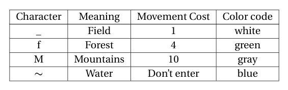
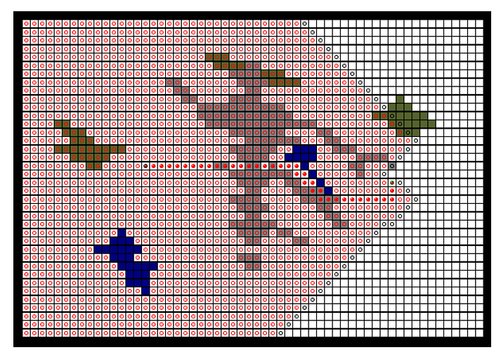

# Pathfinding
Project was completed for CS 570 Artificial Intelligence at University of Idaho.
## Abstract
The aim of this project is to become more familiar with search agents. Search
 agents findastart state, then try to find a series of actions to reach the goal state.
 In this project, we are given a map, a start point at (18,16), and an end point at
 (20,47). The map is given as a text file with different characters , where each char-
acter has a different movement cost and is represented with a different color in
 the output map as shown below: 

## Algorithms: 
- Breadth First Search
- Lowest Cost Search
- Greedy Best First Search with Euclidean and Manhatten
- A* Search with Euclidean and Manhatten

